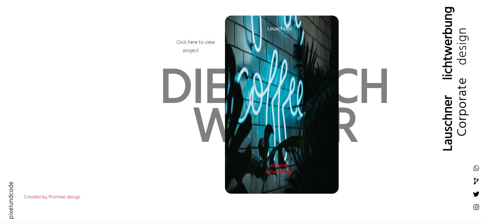
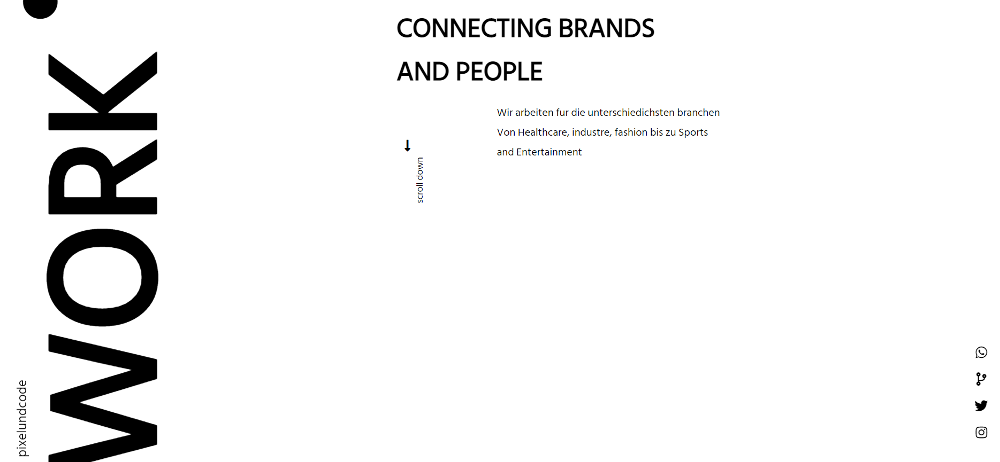
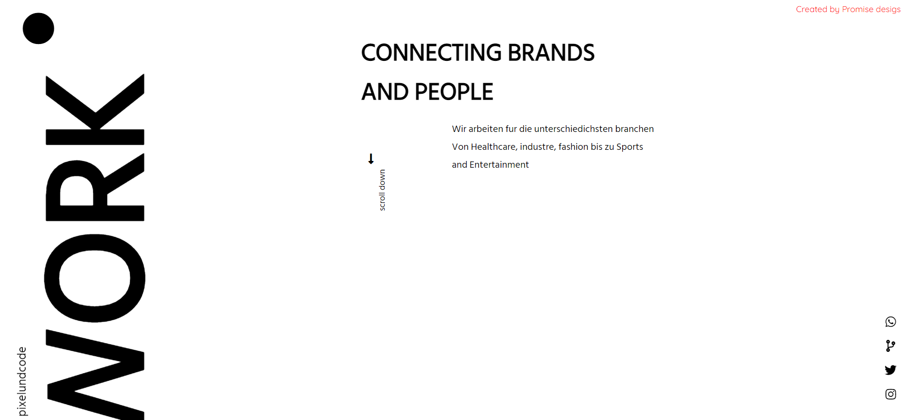
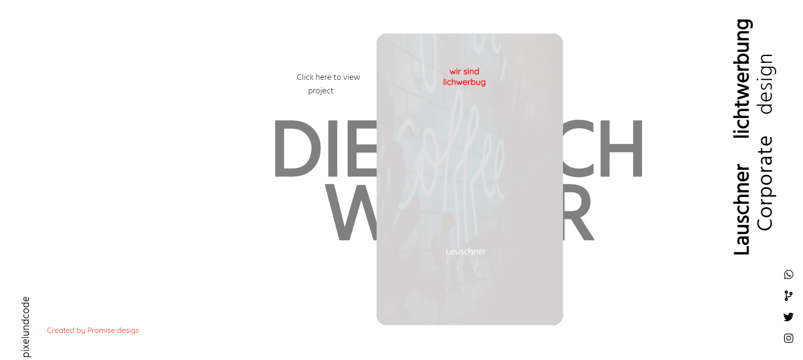
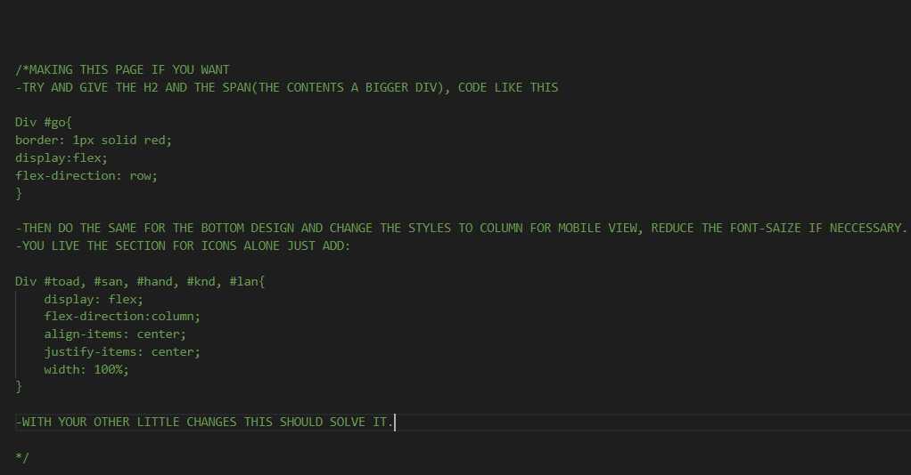

 # A COPORATE LAYOUT OF A DESIGNED SITE

 ## Welcome!

 ##let's get started.

 Thank you for checking this work.

 ## About This Work:
   This is a Basic website, which is showcasing different types of design layout and patterns. Firstly this beautiful work is for practsing on understanding and broadening of the CSS position property. This property is very powerful for complex lay-out of Text images and design patterns.

## pictures of this Work
 ##An Example##
 

 ##process##
      THIS FILE IS FOR THE PRACTISE OF HTML(DEEPER)
 -PRACTISE FOR THE BUILDING OF MODERN SEMANTIC WEBSITE
 -STRUCTURES OF DIFFERENT , AND PROPER DISPLAY OF MARKUP'S IN A CONTAINER.
 -PRACTISED PROPER INTERNAL LINKING OF PAGES WITHIN A CONTAINER.

    THIS FILE IS FOR THE PRACTISE OF CSS
 -PRACTISED USING THE POSITION PROPERTY TO YIELD OUT A BEAUTIFUL LAYOUT OF DIFFERENT SECTIONS.
 -PRACTISED USING PROPER FONTS AND FONT-SIZES TO ENSURE BEAUTIFUL OUTCOME OF TEXT TEXTURES IN HTML.

##worked on an Hover section##
-CSS HOVER-EFFECT: Super useful syntax used to animate elements for little interactions on cursor hover.

  ## Built with         
      -HTML(Hypertext Mark-up Language)
      -CSS(Cascading Styles Sheet)

  ## My Challanges and lessons
   Learnt how To use the position property to my advantage in ensuring proper lay-out and design of website
   To make the site a little responsive you can try and add these for those who will love to clone nd make use in your local machine.

   

   ## Installations
   -For those Farmiliar with Git-hub you can clone the repo and pull to your local workplace to view.

   -For those who want to check the work rom the site, click here [https://app.netlify.com/sites/trusting-snyder-ea107e], to view Thank you once again.

   ## Best syntax Used

    ``CSS
   (transform), (flex-box), and (power of proper font usage).
  Transform is very important for efficient animations to improver the ui's of a website, with the flex-box to avoid dis-mantle of sections and our all underrated font usage.
   ``

   ## Resources that helped ##
   -For the Colors[https://htmlcolorcodes.com/color-names/]

   -For the images[https://unsplash.com/]

   -For the Fonts[https://fonts.google.com/] 

   -For the icons[https://fontawesome.com/]

 ## Licsense 
   This work is under [MIT] liscence. It's highly free and opensource to anyone.
